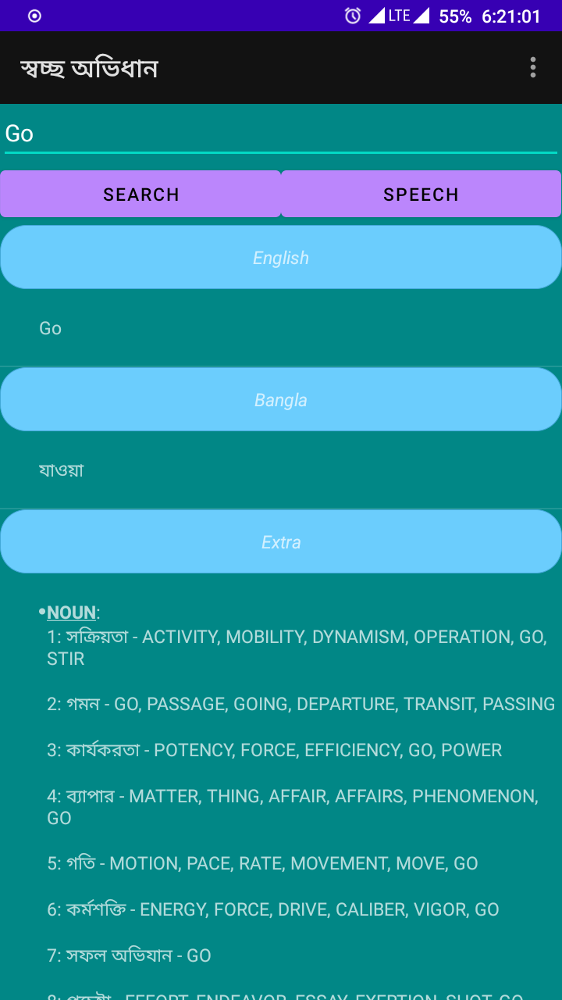

<h2 align="center"><b>Swoccho Dictionary</b></h2>
<h4 align="center">Free & Open Source English-Bangla Dictionary for Android.</h4>

<a  href="https://github.com/rafiz001/swoccho-dic/releases/download/v1.0/app-debug.apk">Download APK from Github Release</a>

<h2 align="center"><b>Features:</b></h2>
<h4 align="center">
<li>Word Meaning</li>
<li>Synonyms</li>
<li>Antonyms</li>
<li>Parts of Speech</li>
<li>Phonetic Spelling</li>
<li>Word Definitions</li>
<li>Examples</li>
<li>Text to Speech</li>

</h4>
<h2 align="center"><b>Screenshot:</b></h2>

<h2 align="center"><b>Credit:</b></h2>
Database collected from <a href="https://github.com/chitholian/Bangla-Dictionary">@chitholian</a>
